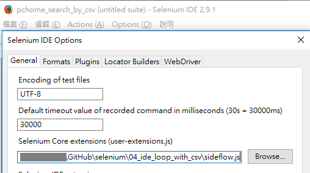
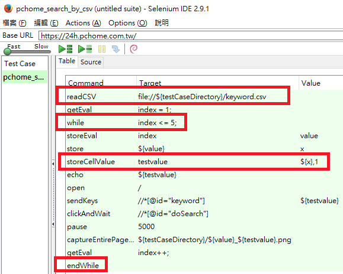

Selenium, looping with csv file input
---

---

#### Credit to abhijain2618 and 73rhodes

# CSV file reader plugin for Selenium IDE
https://github.com/abhijain2618/csvreader
* CSVRead_Selenium-IDE.js

# Flow control extension for Selenium IDE
https://github.com/73rhodes/sideflow
* sideflow.js

---

# Sample files:
* [keyword.csv](keyword.csv)
* [pchome_search_by_csv.html](pchome_search_by_csv.html)

| | | |
|---|---|---|
|storeEval | Preferences.getString(&quot;testCaseDirectory&quot;) | testCaseDirectory|
| runScript | javascript{window.opener.resizeTo(1024,768);} |  |
|readCSV | file://${testCaseDirectory}/keyword.csv |  |
|getEval | index = 1; |  |
|while | index &lt;= 5; |  |
|storeEval | index | value</td>
| store | ${value} | x |
|storeCellValue | testvalue | ${x},1|
|echo | ${testvalue} |  |
|open | / ||
|sendKeys | //*[@id=&quot;keyword&quot;] | ${testvalue}|
|clickAndWait | //*[@id=&quot;doSearch&quot;] |  |
|pause | 5000 ||
|captureEntirePageScreenshot | ${testCaseDirectory}/${value}_${testvalue}.png |  |  
|getEval | index++; | |
|endWhile | | |  

---

# Demo

## Setup

### Selenium Core extension

### open Test Case and execute

### Result

Screenshot from "captureEntirePageScreenshot"
* [1_asus.png](1_asus.png)
* [3_benq.png](3_benq.png)
* [2_acer.png](2_acer.png)
* [4_dell.png](4_dell.png)
* [5_lenovo.png](5_lenovo.png)
