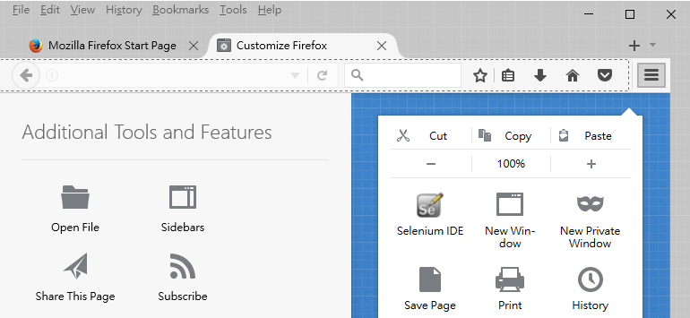
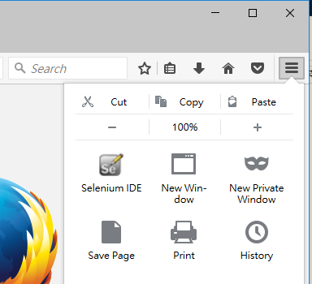

Use Selenium IDE for Web Test Automation
---

## Setup

### Firefox

Portable Firefox   
http://portableapps.com/apps/internet/firefox_portable

### Add-on

https://addons.mozilla.org/en-US/firefox/addon/selenium-ide/?src=search

https://addons.mozilla.org/en-US/firefox/addon/selenium-ide-button/?src=search

https://addons.mozilla.org/en-US/firefox/addon/stored-variables-viewer-seleni/?src=search

https://addons.mozilla.org/en-US/firefox/addon/screenshot-on-fail-selenium/?src=search

https://addons.mozilla.org/en-US/firefox/addon/selenium-expert-selenium-ide/?src=search

https://addons.mozilla.org/en-US/firefox/addon/highlight-elements-selenium-id/?src=search

## Step by Step

* open Add-on

* find Selenium IDE and his good friends

* customized tool bar in advance

* enjoy

## demo

| . | . | . |
|---|---|---|---|
|storeEval | Preferences.getString("testCaseDirectory")	| testCaseDirectory |
| open | /xrt?Lang=zh-TW | |
| storeText | id=h1_small_id | stringDate|
| store | javascript{storedVars.stringDate.split('/').join('_')}	| filenamePrefix |
| storeText | //tr[8]/td[3] | JPY |
| captureEntirePageScreenshot |  ${testCaseDirectory}/${filenamePrefix}_JPY_${JPY}.png |  |

* test script: [rate_bot.html](rate_bot.html)
* output: [2016_11_22_JPY_0.2902.png](2016_11_22_JPY_0.2902.png)
